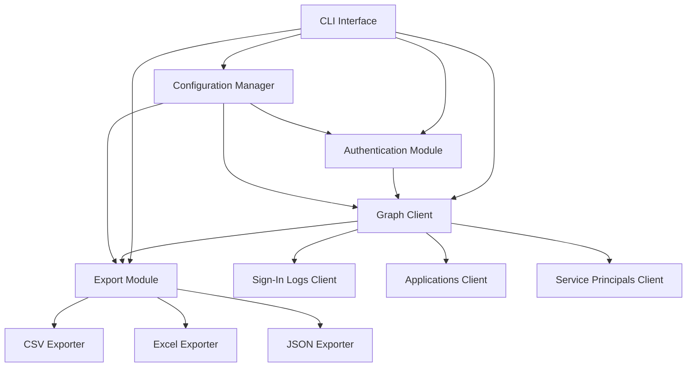
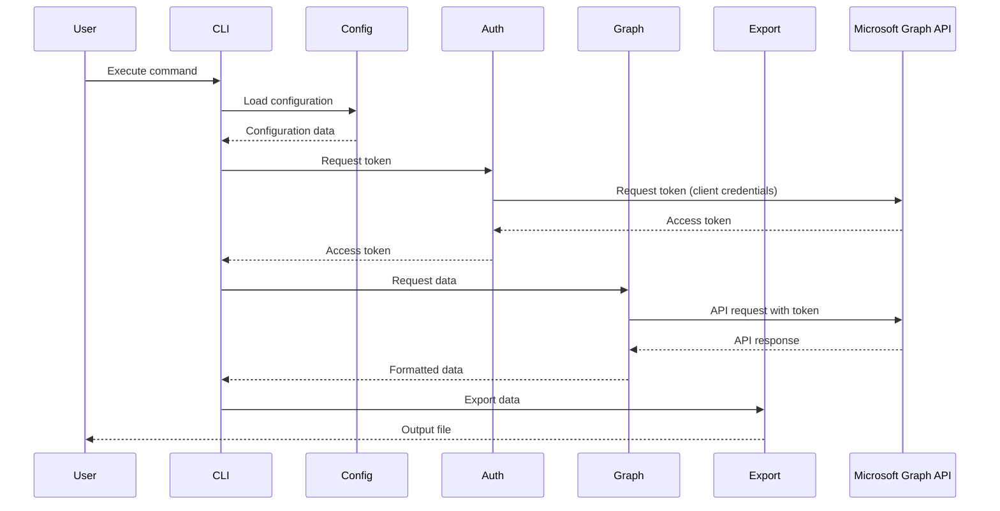
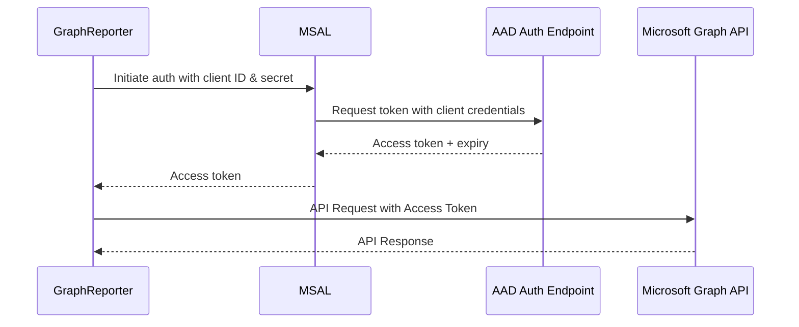

# Architecture

## System Overview

GraphReporter is a Python-based CLI tool that interacts with Microsoft Graph API to retrieve and report on Azure AD data. The system follows a modular architecture with clear separation of concerns.

## Component Architecture

The system is structured into the following main components:



### Components Description

#### 1. CLI Interface
- Responsible for parsing command-line arguments
- Provides user-friendly commands and options
- Handles user interaction and output formatting
- Uses the Typer library for creating the CLI interface

#### 2. Configuration Manager
- Manages application configuration
- Handles loading and validating credentials
- Supports multiple configuration sources (environment variables, config files)
- Ensures secure handling of sensitive configuration data

#### 3. Authentication Module
- Implements client credentials flow using MSAL
- Handles token acquisition and management
- Implements token caching and refresh logic
- Provides authentication context to other modules

#### 4. Graph Client
- Core component that interacts with Microsoft Graph API
- Handles common API operations and error handling
- Manages pagination for large result sets
- Specialized into subclients for specific data types:
  - Sign-In Logs Client: Retrieves sign-in logs with filtering
  - Applications Client: Retrieves app registration data
  - Service Principals Client: Retrieves enterprise app data

#### 5. Export Module
- Converts API response data to different output formats
- Supports CSV, Excel, and JSON output formats
- Handles data transformation and formatting
- Ensures consistent output structure across formats

## Data Flow



## Security Architecture

The authentication flow is implemented using the client credentials grant flow:



Security considerations:
1. Client secret is stored securely and never logged
2. Token cache is secure and in-memory only
3. Immediate token invalidation if credentials are changed
4. Proper error handling without exposing sensitive information

## Technical Dependencies

- Python 3.8+
- MSAL Python for authentication
- Requests for HTTP communication
- Pandas for data manipulation
- Typer for CLI interface
- Pytest for testing
- Python-dotenv for environment variables

## File Structure

```
graphreporter/
├── cli/                 # CLI commands and entry points
│   ├── __init__.py
│   ├── commands.py      # CLI command definitions
│   └── main.py          # Main CLI entry point
├── auth/                # Authentication module
│   ├── __init__.py
│   └── client.py        # MSAL authentication client
├── graph/               # Graph API clients
│   ├── __init__.py
│   ├── client.py        # Base Graph client
│   ├── applications.py  # Applications client
│   ├── signins.py       # Sign-ins client
│   └── serviceprincipals.py # Service principals client
├── export/              # Export module
│   ├── __init__.py
│   ├── base.py          # Base exporter interface
│   ├── csv_exporter.py  # CSV export implementation
│   ├── excel_exporter.py # Excel export implementation
│   └── json_exporter.py # JSON export implementation
├── config/              # Configuration management
│   ├── __init__.py
│   └── settings.py      # Configuration handling
├── utils/               # Utility functions
│   ├── __init__.py
│   └── helpers.py       # Helper functions
├── __init__.py
├── __main__.py          # Package entry point
├── requirements.txt     # Dependencies
├── setup.py             # Package setup
└── README.md            # Documentation
```

## Extension Points

The architecture is designed with the following extension points:

1. Additional data types from Microsoft Graph can be added by creating new client modules
2. New export formats can be added by implementing the base exporter interface
3. Authentication methods can be extended to support other flows
4. Additional CLI commands can be easily added to the command structure
